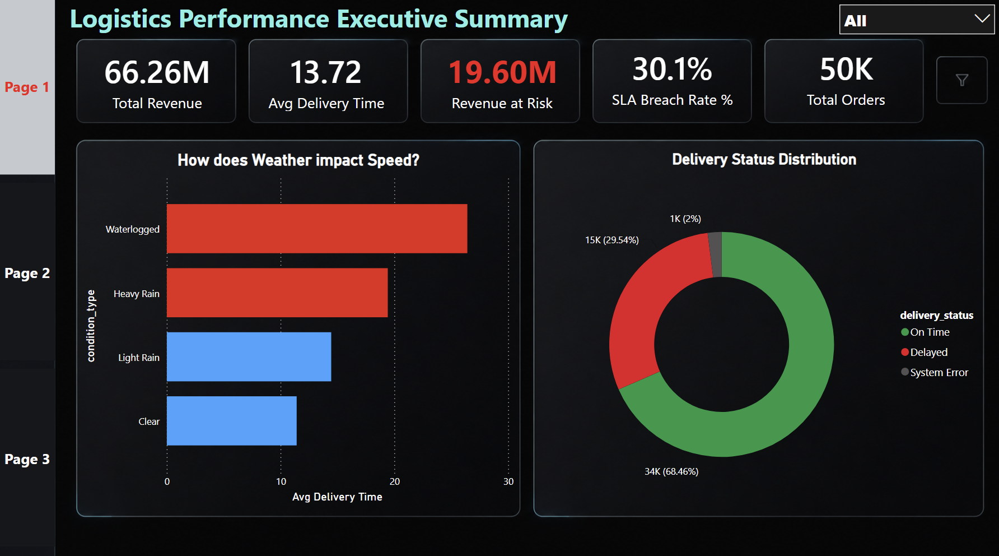

# Logistics Revenue Risk Analysis 🚚💸

**Author:** Tony Antony | PL-300 Certified Data Analyst

## 📌 The Business Problem
A quick-commerce logistics network in Bangalore was consistently failing its 15-minute delivery Service Level Agreement (SLA). The VP of Operations needed to understand exactly *where* and *why* the network was breaking down, and more importantly, how much high-value revenue was being placed at risk due to delayed orders.

This project is an end-to-end data analytics pipeline designed to ingest raw delivery logs, identify operational bottlenecks, and prescribe actionable pricing and fleet management strategies.

*(Note: Ensure the image path above exactly matches your screenshot file name in your images folder)*

## 🛠️ The Tech Stack & Architecture
* **Python (Pandas, NumPy):** Engineered a 50,000-record synthetic dataset to simulate uneven geographical volume and weather-based traffic penalties. Handled data cleaning and simulated missing-timestamp hardware failures.
* **PostgreSQL:** Migrated flat files into a fully normalized Star Schema (Fact and Dimension tables) via terminal CLI for optimized querying.
* **Power BI:** Built a 3-page interactive cinematic dark-mode application using advanced DAX to calculate 'Revenue at Risk' and an AI Decomposition Tree for root cause analysis.

## ⚙️ The Data Pipeline Workflow

### 1. Data Generation & ETL (Python)
Instead of using clean, static datasets, I engineered realistic business logic:
* Assigned specific baseline delivery times (8-12 mins) with compound penalties for hubs like Whitefield and severe weather events.
* **Data Maturity Decision:** Injected a 2% failure rate of missing timestamps. Rather than using `.dropna()` and deleting valid financial data, I engineered a categorical `System Error` flag in Python, protecting total revenue tracking while isolating IT API failures.

### 2. Data Warehousing (SQL)
Loaded the cleaned dataset into a PostgreSQL database and modeled it into a Star Schema:
* `fact_deliveries` (50,000 rows mapped with numeric foreign keys)
* `dim_hubs` (Koramangala, Indiranagar, Whitefield, Electronic City)
* `dim_weather` (Clear, Light Rain, Heavy Rain, Waterlogged)

### 3. Business Intelligence & UI/UX (Power BI)
Developed the "Logistics Performance Command Center" featuring:
* **Custom DAX Metrics:** `Revenue at Risk`, `SLA Breach Rate %`
* **App-like UI:** Glassmorphism layout, dynamic page navigation, and conditional formatting (SLA breaches automatically trigger Crimson Red alerts).

## 💡 Key Insights Discovered
1. **The Financial Threat:** The network currently has **₹19.6M in gross revenue** directly tied to delayed deliveries across 50,000 orders.
2. **The Root Cause (The Whitefield Collapse):** Utilizing the AI Decomposition tree, I isolated that the Whitefield hub suffers a **100% SLA failure rate** specifically during Waterlogged conditions.
3. **The Silent Hardware Issue:** Exactly 2% of total volume (1,000 orders) bypassed SLA tracking completely due to missing completion timestamps.

## 🚀 Prescriptive Action Plan
Based on the data, I recommend the following immediate business interventions:
* **Dynamic Surge Pricing:** Implement weather-triggered surge pricing specifically during 'Heavy Rain' and 'Waterlogged' alerts to offset SLA refund costs.
* **Variable SLAs:** Increase the promised SLA from 15 mins to 25 mins for the Whitefield radius strictly during adverse weather to protect brand trust.
* **IT Infrastructure Audit:** Immediate technical audit required on rider GPS app APIs and the order-closing software handoffs to patch the 2% timestamp failure rate.
